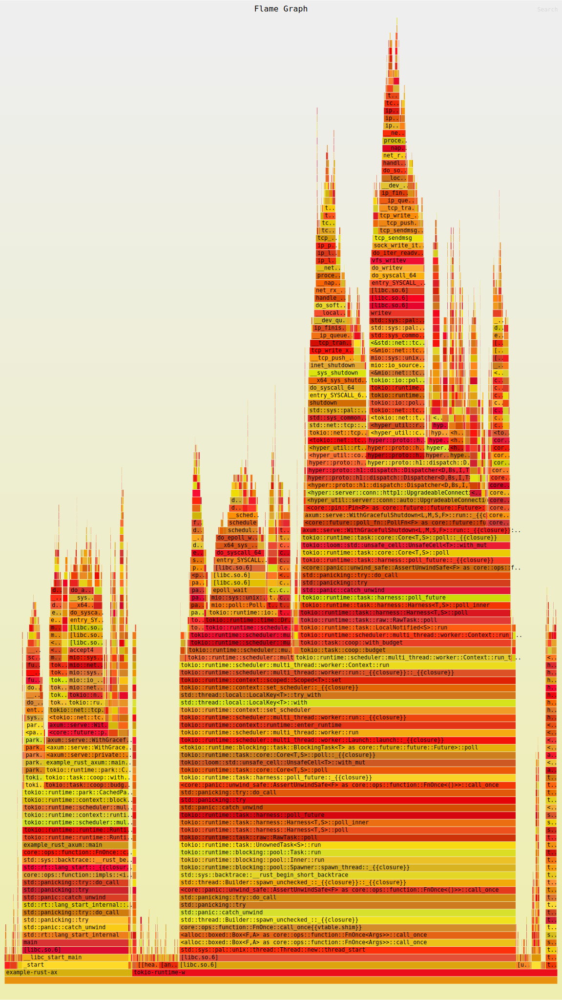

# CPU profiling tests

stressing out my own projects. And maybe yours too. :D

## First step

Clone the repository that provides the tools to create FlameGraphs:

```sh
git clone git@github.com:brendangregg/FlameGraph.git
```

<hr>

## Golang Gin

The Gin project includes a middleware to serve profiling data. You can customize the default route
see the documentation here: https://github.com/gin-contrib/pprof

### Example

### Go to the example directory:

```sh
cd example-golang-gin
```

### Run the application:

```sh
go run main.go
```

### Run a simple script to make requests to the application:

```sh
while true; do curl http://localhost:8080; echo; done
```

### Fetch a 30 second CPU profile from the application:

```sh
go tool pprof \
  -raw -output=pprof.txt \
  'http://localhost:8080/debug/pprof/profile?seconds=30'
```

### Use the script stackcollapse-go.pl to interpret the Golang pprof data:

```sh
./stackcollapse-go.pl tests/pprof.txt | ./flamegraph.pl > flame-golang.svg
```

<hr>

You can also use pprof with the default HTTP package.

### Go to the example directory

```sh
cd example-golang-http
```

### Run the application

```sh
go run main.go
```

The next steps are the same as in the previous example. :)

<hr>

## Rust Axum Framework

In this case we need the perf installed:

### ArchLinux

```sh
sudo pacman -S linux-tools
```

### Fedora

```sh
sudo dnf install kernel-tools
```

### Debian / Ubuntu

```sh
sudo apt install linux-perf
```

### Go to the example directory:

```
cd example-rust-axum
```

### Install the flamegraph:

```sh
cargo install flamegraph
```

### Adjusted perf_event_paranoid setting in the kernel:

```sh
sysctl -w kernel.perf_event_paranoid=-1
```

### Run the flameGraph:

```
export CARGO_PROFILE_RELEASE_DEBUG=true
cargo flamegraph -o flame-rust-axum.svg
```

<hr>

## FlameGraph results:

### Gin framework


### Default HTTP package


### Rust Axum



<hr>

## References

Important information:

```
The colors aren't significant, and are usually picked at random to be warm colors (other meaningful palettes are supported). This visualization was called a "flame graph" as it was first used to show what is hot on-CPU, and, it looked like flames. It is also interactive: mouse over the SVGs to reveal details, and click to zoom
```

* https://pkg.go.dev/net/http/pprof

* https://www.brendangregg.com/FlameGraphs/cpuflamegraphs.html
